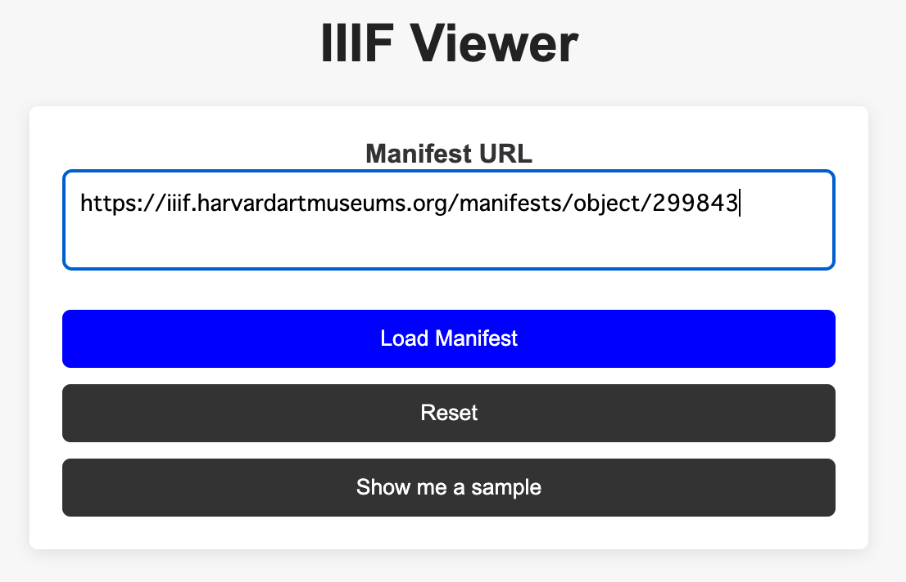

# DH IIIF Viewer

DH IIIF Viewer is a web application designed to display images using the [IIIF (International Image Interoperability Framework)](https://iiif.io/). It integrates the Mirador Viewer, allowing users to load and view images from a specified Manifest URL.

## Overview

This project provides a simple viewer for displaying images based on the IIIF standard. Users can input a Manifest URL, and the images will be displayed through the Mirador Viewer.

## Features

- Load IIIF images from a valid Manifest URL. Some might not open them because of XSS.
- Display a message when the image is successfully shown
- Provide a sample Manifest URL
- Display an error message if the image cannot be loaded
- Auto-fade out the message display area after 10 seconds

## Demo

## Installation

To install this project locally, follow these steps:

1. Download all files into one directory.

2. Place the directory in anywhere on your local computer.

3. Open `index.html` in your browser.

## Usage

1. Enter the Manifest URL in the form and click the "Load Manifest" button.
2. The specified Manifest URL will be loaded, and the image will be displayed in the Mirador Viewer.
3. To display a sample Manifest, click the "Show me a sample" button.
4. Use the reset button to clear the form.

## File Structure

- `index.html`: Main HTML file
- `style.css`: Stylesheet
- `script_iiif.js`: JavaScript file
- `mirador.min.js`: JavaScript file for Mirador Viewer
- `image_tools.js`: Optional image tools plugin

## Licenses and Links

### Mirador Viewer

`mirador.min.js` is part of the Mirador Viewer project. Mirador is an open-source project licensed under the [Apache License 2.0](https://www.apache.org/licenses/LICENSE-2.0). For more information about Mirador, visit the [official website](https://projectmirador.org/).

### Image Tools Plugin

`image_tools.js` is used from the Mirador Image Tools project. This plugin is also licensed under the [Apache License 2.0](https://www.apache.org/licenses/LICENSE-2.0). For more details, check the [GitHub repository](https://github.com/ProjectMirador/mirador-image-tools).

## License

This project is licensed under the MIT License. See the `LICENSE` file for details.
